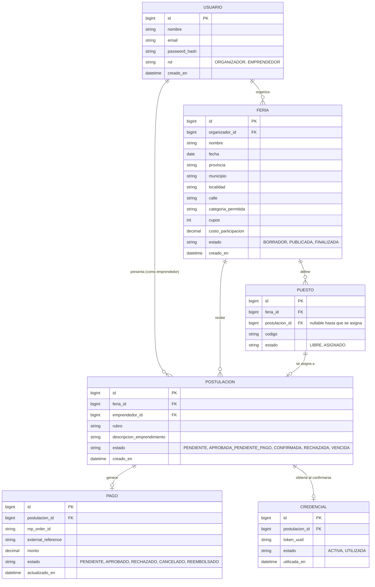

# Diagrama Entidad-Relación (borrador inicial)

Basado en las entidades y estados mencionados en el README (secciones 3, 4.5). A revisar y ajustar por el equipo antes de generar el script DDL definitivo.

## Notas

- `PAGO` y `CREDENCIAL` son 1 a 1 (o 1 a 0) con `POSTULACION`, siguiendo el flujo descripto en el README: una postulación confirmada tiene un pago aprobado y genera exactamente una credencial.
- `PUESTO` pertenece a una `FERIA` y se vincula opcionalmente a una `POSTULACION` una vez asignado (sección 3, paso 8 del README).
- Los valores de `estado` reflejan exactamente los definidos en la sección 4.5 del README, para mantener consistencia entre documentación y modelo de datos.
- Este diagrama es un punto de partida: falta validar tipos de dato definitivos, índices y claves únicas (por ejemplo, `email` en `USUARIO`, `token_uuid` en `CREDENCIAL`) antes de convertirlo en el script DDL final.
