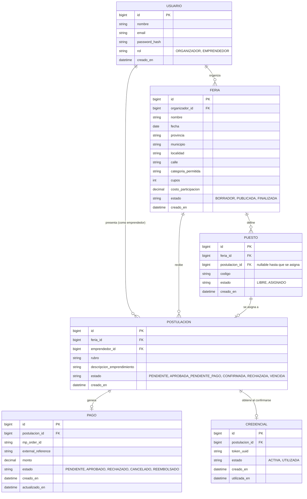

# Diagrama Entidad-Relación — sincronizado con `schema.sql` (Etapa 3)

Basado en las entidades y estados del `database/schema.sql`, sincronizado con la sección 4.5 del `README.md`.

## Notas

- `PAGO` y `CREDENCIAL` son 1 a 1 (o 1 a 0) con `POSTULACION`, siguiendo el flujo descripto en el README: una postulación confirmada tiene un pago aprobado y genera exactamente una credencial.
- `PUESTO` pertenece a una `FERIA` y se vincula opcionalmente a una `POSTULACION` una vez asignado (sección 3, paso 8 del README).
- Los valores de `estado` reflejan exactamente los definidos en la sección 4.5 del README, para mantener consistencia entre documentación y modelo de datos.
- Este diagrama está sincronizado con `database/schema.sql` al cierre de la Etapa 3. Las claves únicas (`uq_postulacion_feria_emprendedor`, `uq_puesto_feria_codigo`, `UNIQUE` en `email`, `external_reference`, `token_uuid` y `postulacion_id` de pago/credencial) están modeladas como restricciones en el propio DDL.
- Decisión de alcance (v1): cada feria admite una sola categoría principal (`categoria_permitida`). El rubro del emprendedor se coteja contra esa categoría. Si en una versión futura se requieren múltiples categorías por feria, se migrará a una tabla `feria_categoria`.
