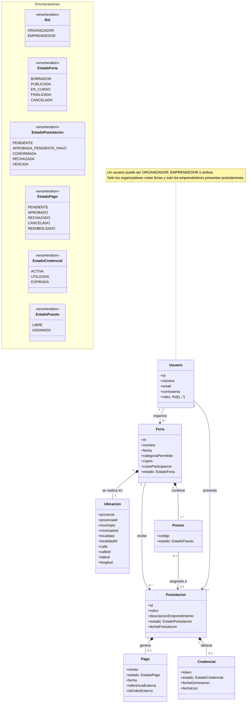

# Diagrama Entidad-Relación Conceptual (UML)

Modelo conceptual del dominio de FeriaConecta, independiente de cualquier tecnología de base de datos.

```mermaid
classDiagram
    class Usuario {
        +id
        +nombre
        +email
        +contrasena
        +roles: Rol[1..*]
    }

    note for Usuario "Un usuario puede ser ORGANIZADOR, EMPRENDEDOR o ambos. <br> Solo los organizadores crean ferias y solo los emprendedores presentan postulaciones."

    class Feria {
        +id
        +nombre
        +fecha
        +categoriaPermitida
        +cupos
        +costoParticipacion
        +estado: EstadoFeria
    }

    class Ubicacion {
        +provincia
        +provinciaId
        +municipio
        +municipioId
        +localidad
        +localidadId
        +calle
        +calleId
        +latitud
        +longitud
    }

    class Postulacion {
        +id
        +rubro
        +descripcionEmprendimiento
        +estado: EstadoPostulacion
        +fechaPostulacion
    }

    class Pago {
        +monto
        +estado: EstadoPago
        +fecha
        +referenciaExterna
        +idOrdenExterno
    }

    class Credencial {
        +token
        +estado: EstadoCredencial
        +fechaGeneracion
        +fechaUso
    }

    class Puesto {
        +codigo
        +estado: EstadoPuesto
    }

    Usuario "1" --> "0..*" Feria : organiza
    Usuario "1" --> "0..*" Postulacion : presenta
    Feria "1" *-- "1" Ubicacion : se realiza en
    Feria "1" --> "0..*" Postulacion : recibe
    Postulacion "1" *-- "0..1" Pago : genera
    Postulacion "1" *-- "0..1" Credencial : obtiene
    Feria "1" *-- "1..*" Puesto : contiene
    Puesto "0..1" --> "0..1" Postulacion : asignado a

    namespace Enumeraciones {
        class Rol {
            <<enumeration>>
            ORGANIZADOR
            EMPRENDEDOR
        }

        class EstadoFeria {
            <<enumeration>>
            BORRADOR
            PUBLICADA
            EN_CURSO
            FINALIZADA
            CANCELADA
        }

        class EstadoPostulacion {
            <<enumeration>>
            PENDIENTE
            APROBADA_PENDIENTE_PAGO
            CONFIRMADA
            RECHAZADA
            VENCIDA
        }

        class EstadoPago {
            <<enumeration>>
            PENDIENTE
            APROBADO
            RECHAZADO
            CANCELADO
            REEMBOLSADO
        }

        class EstadoCredencial {
            <<enumeration>>
            ACTIVA
            UTILIZADA
            EXPIRADA
        }

        class EstadoPuesto {
            <<enumeration>>
            LIBRE
            ASIGNADO
        }
    }
```

## Descripción de relaciones

| Relación | Cardinalidad | Significado |
|---|---|---|
| Usuario organiza Feria | 1 a 0..* | Un organizador puede crear cero o muchas ferias. |
| Usuario presenta Postulacion | 1 a 0..* | Un emprendedor puede presentar cero o muchas postulaciones. |
| Feria se realiza en Ubicacion | 1 a 1 | Cada feria tiene exactamente una ubicación. La ubicación no existe independientemente de la feria. |
| Feria recibe Postulacion | 1 a 0..* | Una feria recibe cero o muchas postulaciones. |
| Postulacion genera Pago | 1 a 0..1 | Una postulación aprobada genera exactamente un pago. |
| Postulacion obtiene Credencial | 1 a 0..1 | Una postulación confirmada obtiene exactamente una credencial. |
| Feria contiene Puesto | 1 a 1..* | Una feria tiene uno o más puestos. |
| Puesto asignado a Postulacion | 0..1 a 0..1 | Un puesto puede asignarse a una postulación confirmada como máximo. |

## Estados del dominio

| Enumeración | Valores |
|---|---|
| `EstadoFeria` | `BORRADOR`, `PUBLICADA`, `EN_CURSO`, `FINALIZADA`, `CANCELADA` |
| `EstadoPostulacion` | `PENDIENTE`, `APROBADA_PENDIENTE_PAGO`, `CONFIRMADA`, `RECHAZADA`, `VENCIDA` |
| `EstadoPago` | `PENDIENTE`, `APROBADO`, `RECHAZADO`, `CANCELADO`, `REEMBOLSADO` |
| `EstadoCredencial` | `ACTIVA`, `UTILIZADA`, `EXPIRADA` |
| `EstadoPuesto` | `LIBRE`, `ASIGNADO` |

## Decisiones de diseño

- **Rol**: se modela como enumeración multivaluada porque un mismo usuario puede ser organizador y emprendedor.
- **Estados**: se modelan como enumeraciones del dominio, tipando el atributo `estado` de cada entidad.
- **Pago y Credencial**: son entidades débiles de Postulacion. No tienen existencia independiente.
- **Puesto**: se identifica por su código dentro de una feria (clave natural). No requiere identificador propio.
- **Ubicacion**: es un value object asociado a Feria. Agrupa los datos devueltos por GeoRef: nombres, IDs del servicio y coordenadas.

## Deuda documental pendiente

Los estados `EstadoFeria` y `EstadoCredencial` incorporan valores nuevos (`EN_CURSO`, `CANCELADA`, `EXPIRADA`) que aún deben reflejarse en:

- `README.md` sección 4.5.
- `database/schema.sql` (restricciones `CHECK`).
