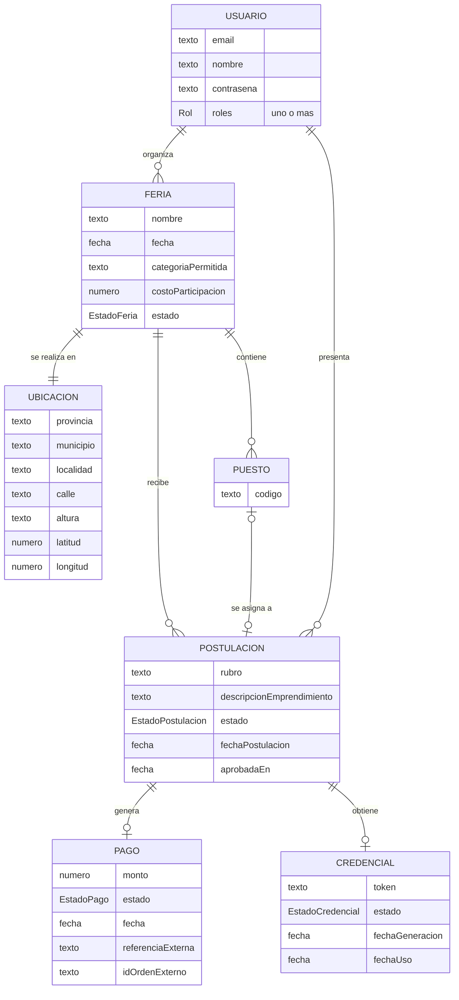

# Diagrama Entidad-Relación Conceptual

Modelo conceptual del dominio de FeriaConecta, independiente de cualquier tecnología utilizada posteriormente para implementar la base de datos.

```mermaid
erDiagram

    USUARIO ||--o{ FERIA : organiza
    USUARIO ||--o{ POSTULACION : presenta

    FERIA ||--|| UBICACION : "se realiza en"
    FERIA ||--o{ POSTULACION : recibe
    FERIA ||--o{ PUESTO : contiene

    POSTULACION ||--o| PAGO : genera
    POSTULACION ||--o| CREDENCIAL : obtiene

    PUESTO o|--o| POSTULACION : "se asigna a"

    USUARIO {
        texto email
        texto nombre
        texto contrasena
        Rol roles "uno o mas"
    }

    FERIA {
        texto nombre
        fecha fecha
        texto categoriaPermitida
        numero costoParticipacion
        EstadoFeria estado
    }

    UBICACION {
        texto provincia
        texto municipio
        texto localidad
        texto calle
        texto altura
        numero latitud
        numero longitud
    }

    POSTULACION {
        texto rubro
        texto descripcionEmprendimiento
        EstadoPostulacion estado
        fecha fechaPostulacion
        fecha aprobadaEn
    }

    PAGO {
        numero monto
        EstadoPago estado
        fecha fecha
        texto referenciaExterna
        texto idOrdenExterno
    }

    CREDENCIAL {
        texto token
        EstadoCredencial estado
        fecha fechaGeneracion
        fecha fechaUso
    }

    PUESTO {
        texto codigo
    }
```

## Entidades

### Usuario

Representa a una persona registrada en FeriaConecta.

**Atributos:**

- `email`
- `nombre`
- `contrasena`
- `roles`

Un usuario puede poseer uno o más roles dentro del sistema:

- `ORGANIZADOR`
- `EMPRENDEDOR`

Un mismo usuario puede cumplir ambos roles.

### Feria

Representa un evento organizado mediante la plataforma.

**Atributos:**

- `nombre`
- `fecha`
- `categoriaPermitida`
- `costoParticipacion`
- `estado`

Estados contemplados:

- `BORRADOR`
- `PUBLICADA`
- `EN_CURSO`
- `FINALIZADA`
- `CANCELADA`

### Ubicacion

Representa el lugar geográfico en el que se realiza una feria.

**Atributos:**

- `provincia`
- `municipio`
- `localidad`
- `calle`
- `altura`
- `latitud`
- `longitud`

Los valores son validados y normalizados mediante GeoRef antes de almacenarse.

### Postulacion

Representa la solicitud realizada por un emprendedor para participar de una feria.

**Atributos:**

- `rubro`
- `descripcionEmprendimiento`
- `estado`
- `fechaPostulacion`
- `aprobadaEn` (fecha en que se aprobó; base para el plazo de pago)

Estados contemplados:

- `PENDIENTE`
- `APROBADA_PENDIENTE_PAGO`
- `CONFIRMADA`
- `RECHAZADA`
- `VENCIDA`

### Pago

Representa el proceso de pago asociado a una postulación aprobada.

**Atributos:**

- `monto`
- `estado`
- `fecha`
- `referenciaExterna`
- `idOrdenExterno`

Estados contemplados:

- `PENDIENTE`
- `APROBADO`
- `RECHAZADO`
- `CANCELADO`
- `REEMBOLSADO`

En la primera versión existe como máximo un pago asociado a cada postulación. En caso de reintento se reutiliza el mismo registro, actualizando la información correspondiente.

### Credencial

Representa la credencial utilizada para acreditar la participación de un emprendedor mediante un código QR.

**Atributos:**

- `token`
- `estado`
- `fechaGeneracion`
- `fechaUso`

Estados contemplados:

- `ACTIVA`
- `UTILIZADA`
- `EXPIRADA`

### Puesto

Representa un espacio disponible dentro de una feria.

**Atributos:**

- `codigo`

No posee un atributo de estado. Se considera libre cuando no se encuentra asociado a una postulación y asignado cuando se vincula a una postulación confirmada.

---

## Descripción de relaciones

| Relación                       | Cardinalidad | Significado                                                                                                                                                                                |
| ------------------------------ | ------------ | ------------------------------------------------------------------------------------------------------------------------------------------------------------------------------------------ |
| Usuario organiza Feria         | 1 a 0..\*    | Un usuario con rol ORGANIZADOR puede crear cero o muchas ferias. Cada feria pertenece un único organizador.                                                                                |
| Usuario presenta Postulacion   | 1 a 0..\*    | Un usuario con rol EMPRENDEDOR puede presentar cero o muchas postulaciones, pero una única vez por feria.                                                                                  |
| Feria se realiza en Ubicacion  | 1 a 1        | Cada feria tiene exactamente una ubicación. La ubicación no existe independientemente de la feria.                                                                                         |
| Feria recibe Postulacion       | 1 a 0..\*    | Una feria recibe cero o muchas postulaciones. Cada postulación corresponde a una única feria.                                                                                              |
| Postulacion genera Pago        | 1 a 0..1     | Una postulación en estado `APROBADA_PENDIENTE_PAGO` genera a lo sumo un pago. Si el pago falla, se puede reintentar reutilizando el mismo registro.                                        |
| Postulacion obtiene Credencial | 1 a 0..1     | Una postulación confirmada puede tener como máximo una credencial.                                                                                                                         |
| Feria contiene Puesto          | 1 a 0..\*    | Una feria puede existir sin puestos mientras se encuentra en preparación, pero debe tener al menos un puesto para ser publicada. La cantidad de cupos se deduce de la cantidad de puestos. |
| Puesto asignado a Postulacion  | 0..1 a 0..1  | Un puesto puede asignarse como máximo a una postulación confirmada y una postulación puede ocupar como máximo un puesto. Ambas deben pertenecer a la misma feria.                          |

## Reglas de negocio

- Solo un usuario con rol `ORGANIZADOR` puede crear una feria.
- Solo un usuario con rol `EMPRENDEDOR` puede presentar una postulación.
- Un emprendedor se postula una sola vez por feria.
- Solo una postulación `CONFIRMADA` ocupa un puesto, y debe ser de la misma feria.
- Solo una postulación en estado `APROBADA_PENDIENTE_PAGO` puede generar un pago.
- Si un pago falla, se reutiliza el mismo registro en reintentos.
- Una feria puede existir sin puestos mientras se encuentra en preparación, pero debe tener al menos un puesto para ser publicada; la cantidad de cupos se deduce de la cantidad de puestos.

## Decisiones de diseño

- **Identificación**: no se modelan identificadores técnicos en el diagrama conceptual. `Usuario` se identifica por `email`; `Feria` por `(organizador, nombre, fecha)`; `Postulacion` por `(Usuario, Feria)`; `Puesto` por `(Feria, codigo)`. `Pago`, `Credencial` y `Ubicacion` son entidades débiles identificadas por `Postulacion` o `Feria`. Las claves sustitutas y los tipos de datos (como `bigint`) se definen en el diseño lógico/físico.
- **Rol**: se modela como un atributo multivaluado porque un mismo usuario puede ser organizador y emprendedor.
- **Estados**: se definen como dominios de valores posibles para el atributo `estado` de cada entidad.
- **Postulación única**: un emprendedor se postula una única vez a cada feria. `RECHAZADA` y `VENCIDA` son estados finales y no habilitan una nueva postulación.
- **Pago**: es entidad débil de `Postulacion` y se reutiliza en reintentos; no se crean múltiples pagos por postulación en la v1. `referenciaExterna` es el identificador de la postulación que se envía al proveedor de pagos; `idOrdenExterno` es el identificador de la orden que genera el proveedor. `monto` refleja lo efectivamente cobrado, que puede diferir del `costoParticipacion` actual de la feria.
- **Credencial**: es entidad débil de `Postulacion`; no tiene existencia independiente.
- **Puesto**: no tiene atributo de estado. Se considera asignado solo cuando está vinculado a una `Postulacion` en estado `CONFIRMADA` y de la misma `Feria`; en cualquier otro caso se considera libre.
- **Cupos**: la cantidad de cupos de una feria se deduce de la cantidad de puestos asociados; no se modela como atributo independiente.
- **Ubicacion**: es una entidad débil dependiente de `Feria`. El servicio de normalización geográfica (GeoRef) se usa para validar y corregir al cargar; se persisten los nombres normalizados, la altura y las coordenadas, sin los identificadores internos del servicio.
