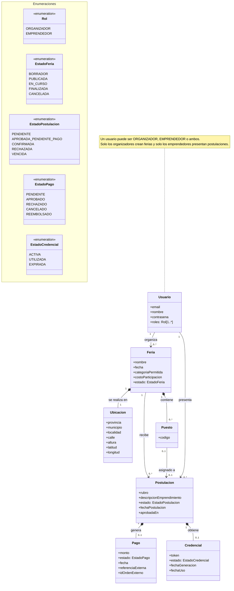

# Diagrama de Clases UML — FeriaConecta

Modelo conceptual de clases del dominio de FeriaConecta, utilizado como apoyo para representar las principales clases, atributos, enumeraciones, relaciones y reglas del sistema.

## Descripción de relaciones

| Relación                       | Cardinalidad | Significado                                                                                                                                                                                |
| ------------------------------ | ------------ | ------------------------------------------------------------------------------------------------------------------------------------------------------------------------------------------ |
| Usuario organiza Feria         | 1 a 0..\*    | Un usuario con rol ORGANIZADOR puede crear cero o muchas ferias. Cada feria pertenece un único organizador.                                                                                |
| Usuario presenta Postulacion   | 1 a 0..\*    | Un usuario con rol EMPRENDEDOR puede presentar cero o muchas postulaciones, pero una única vez por feria.                                                                                  |
| Feria se realiza en Ubicacion  | 1 a 1        | Cada feria tiene exactamente una ubicación. La ubicación no existe independientemente de la feria.                                                                                         |
| Feria recibe Postulacion       | 1 a 0..\*    | Una feria recibe cero o muchas postulaciones. Cada postulación corresponde a una única feria.                                                                                              |
| Postulacion genera Pago        | 1 a 0..1     | Una postulación en estado `APROBADA_PENDIENTE_PAGO` genera a lo sumo un pago. Si el pago falla, se puede reintentar reutilizando el mismo registro.                                        |
| Postulacion obtiene Credencial | 1 a 0..1     | Una postulación confirmada puede tener como máximo una credencial.                                                                                                                         |
| Feria contiene Puesto          | 1 a 0..\*    | Una feria puede existir sin puestos mientras se encuentra en preparación, pero debe tener al menos un puesto para ser publicada. La cantidad de cupos se deduce de la cantidad de puestos. |
| Puesto asignado a Postulacion  | 0..1 a 0..1  | Un puesto puede asignarse como máximo a una postulación confirmada y una postulación puede ocupar como máximo un puesto. Ambas deben pertenecer a la misma feria.                          |

## Estados del dominio

| Enumeración         | Valores                                                                      |
| ------------------- | ---------------------------------------------------------------------------- |
| `Rol`               | `ORGANIZADOR`, `EMPRENDEDOR`                                                 |
| `EstadoFeria`       | `BORRADOR`, `PUBLICADA`, `EN_CURSO`, `FINALIZADA`, `CANCELADA`               |
| `EstadoPostulacion` | `PENDIENTE`, `APROBADA_PENDIENTE_PAGO`, `CONFIRMADA`, `RECHAZADA`, `VENCIDA` |
| `EstadoPago`        | `PENDIENTE`, `APROBADO`, `RECHAZADO`, `CANCELADO`, `REEMBOLSADO`             |
| `EstadoCredencial`  | `ACTIVA`, `UTILIZADA`, `EXPIRADA`                                            |

## Reglas de negocio

- Solo un usuario con rol `ORGANIZADOR` puede crear una feria.
- Solo un usuario con rol `EMPRENDEDOR` puede presentar una postulación.
- Un emprendedor se postula una sola vez por feria.
- Solo una postulación `CONFIRMADA` ocupa un puesto, y debe ser de la misma feria.
- Solo una postulación en estado `APROBADA_PENDIENTE_PAGO` puede generar un pago.
- Si un pago falla, se reutiliza el mismo registro en reintentos.
- Una feria puede existir sin puestos mientras está en preparación, pero debe tener al menos un puesto para ser publicada.

## Decisiones de diseño

- **Identificación**: no se modelan identificadores técnicos en el diagrama conceptual. `Usuario` se identifica por `email`; `Feria` por `(organizador, nombre, fecha)`; `Postulacion` por `(Usuario, Feria)`; `Puesto` por `(Feria, codigo)`. `Pago`, `Credencial` y `Ubicacion` son entidades débiles identificadas por `Postulacion` o `Feria`. Las claves sustitutas y los tipos de datos (como `bigint`) se definen en el diseño lógico/físico.
- **Rol**: se modela como enumeración multivaluada porque un mismo usuario puede ser organizador y emprendedor.
- **Estados**: se modelan como enumeraciones del dominio, tipando el atributo `estado` de cada entidad.
- **Postulación única**: un emprendedor se postula una única vez a cada feria. `RECHAZADA` y `VENCIDA` son estados finales y no habilitan una nueva postulación.
- **Pago**: es entidad débil de `Postulacion` y se reutiliza en reintentos; no se crean múltiples pagos por postulación en la v1. `referenciaExterna` es el identificador de la postulación que se envía al proveedor de pagos; `idOrdenExterno` es el identificador de la orden que genera el proveedor. `monto` refleja lo efectivamente cobrado, que puede diferir del `costoParticipacion` actual de la feria.
- **Credencial**: es entidad débil de `Postulacion`; no tiene existencia independiente.
- **Puesto**: no tiene atributo de estado. Se considera asignado solo cuando está vinculado a una `Postulacion` en estado `CONFIRMADA` y de la misma `Feria`; en cualquier otro caso se considera libre.
- **Cupos**: la cantidad de cupos de una feria se deduce de la cantidad de puestos asociados; no se modela como atributo independiente.
- **Ubicacion**: es una entidad débil de `Feria` (relación de composición). El servicio de normalización geográfica (GeoRef) se usa para validar y corregir al cargar; se persisten los nombres normalizados, la altura y las coordenadas, sin los identificadores internos del servicio.
